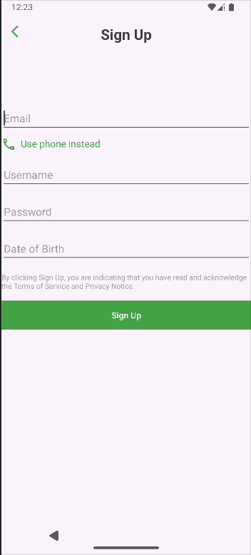

<!-- (This is a comment) INSTRUCTIONS: Go through this page and fill out any **bolded** entries with their correct values.-->

# AND101 Project 3 - AnimalApps

Submitted by: **Charidi Stevens**

Time spent: **6** hours spent in total

## Application Features

<!-- (This is a comment) Please be sure to change the [ ] to [x] for any features you completed.  If a feature is not checked [x], you might miss the points for that item! -->

The following REQUIRED features are completed:

- [x] Pick an app screenshot to duplicate
  - Be sure to add the screenshot to "Chosen Screenshot" below.
- [x] Create a runnable app that displays an Animal Version of your chosen screenshot
- [x] Layout uses one (1) or more ConstraintLayout
- [x] Layout uses one (1) or more ImageView
- [x] Layout uses three (3) or more TextViews

## Chosen Screenshot

I have chosen to duplicate the following layout from the **App Name Here** app:

## Video Demo

Here's a video / GIF that demos all of the app's implemented features:

## License

Copyright **2024** **Charidi Stevens**

Licensed under the Apache License, Version 2.0 (the "License");
you may not use this file except in compliance with the License.
You may obtain a copy of the License at

    http://www.apache.org/licenses/LICENSE-2.0

Unless required by applicable law or agreed to in writing, software
distributed under the License is distributed on an "AS IS" BASIS,
WITHOUT WARRANTIES OR CONDITIONS OF ANY KIND, either express or implied.
See the License for the specific language governing permissions and
limitations under the License.
